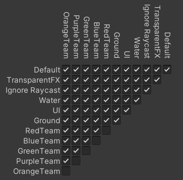

# PEC 3 - Un juego de artilleria

## Cómo jugar
El objetivo del juego es vencer al resto de equipos y ser el único con personajes en pie. Para ello, el jugador dispone de dos tipos de armas, un lanzador de misiles y una granada.

En el menú, el jugador escoge el número de equipos que participarán y el número de personajes por equipo. A continuación, se define cada uno de dichos equipos, con nombre, color y si son IA o no. Además, se escoge el aspecto y el nombre que tendrá cada personaje.

Una vez hechos los equipos, los personajes son lanzados a un terreno que deberán explorar, por turnos, en busca de personajes de otro equipo, para dispararles y ganar la partida. Cada turno dura 10 segundos en los que los equipos podrán moverse, disparar o cambiar el personaje activo.

## Estructura e implementación
Este juego se divide en tres escenas: el menú de inicio, en el que se deciden los equipos, la escena de juego, y la escena de fin, que determina quién ha ganado.

En la primera escena, definimos dos clases: MenuManager y GameOptionsManager. Ambos los definimos siguiendo el patrón singleton, de forma que no se destruyan al cambiar de escena y solo exista uno en todo momento. El primero se encarga de los cambios de escena y de la salida de la aplicación, mientras que el segundo controla todas las operaciones referentes a la selección de equipos, además de almacenar la información de los mismos. Para esto, además, utilizamos dos clases que definen varias variables referentes a los equipos, la clase Team, y a los personajes, la clase Character.

En la escena de juego, el encargado de controlarlo todo es el GameplayManager, que seguirá también el patrón singleton. Este se encargará de inicializar los equipos y los personajes definidos en el menú y almacenados en la instancia del GameOptionsManager. Su función será, además, controlar los cambios de turno y los cambios de personaje, además de saber cuantos equipos y cuantos personajes quedan, y, por tanto, cuando se acaba el juego.

El control de los personajes está definido por dos scripts, PlayerController y AICharacter. El segundo hereda del primero, de forma que es el primero el que contiene los métodos comunes de los personajes controlados por jugador y los personajes controlados por código. En el primero definimos, por tanto, los métodos necesarios para el movimiento, el cambio de arma y la pérdida de vida, además de leer los inputs del jugador. En el AICharacter, controlamos cuando un personaje IA decide si moverse, cambiar de dirección, cambiar de arma, cambiar de personaje o disparar. Este tipo de personaje, además, tiene un trigger con una clase EnemyDetectionTrigger que determinará cuando hay un enemigo cerca y cuando no. Este trigger diferencia a los enemigos comprobando si tiene el tag "Character". Para ello, es necesario que el trigger comparta LayerMask con los personajes de su equipo, ya que hemos definido la matriz de colisiones de forma que se ignoran las colisiones con tu equipo.

Para la definición de distintas armas y sus proyectiles, creamos dos clases que heredan de la clase ScriptableObject, WeaponSO y ProjectileSO. Estas, además de la información del arma o proyectil concreto, definen métodos para concretar el sprite o la layer mask que deberán tener según el color de equipo escogido. Además de los ScriptableObjects, tenemos una clase Weapon y una clase Projectile que heredan de MonoBehaviour para el control del GameObject del arma o del proyectil. Weapon es la clase que controla el disparo, de forma que PlayerController solo sabe qué WeaponSOs tiene disponible y qué Weapon tiene seleccionada. La clase Weapon, será, por tanto, la que sepa el tipo de proyectil que debe lanzar, y el que asignará a este sus propiedades definidas por un ProjectileSO. La clase Projectile, por su parte, se encarga de detectar cuando colisiona con otro objeto y es destruido después de accionar un sistema de partículas y esperar a que este acabe. Si colisiona con un PlayerController, le aplicará el daño que ese tipo de proyectil da.

Por otro lado, tenemos varios scripts que controlan la UI, como son el Timer, CharacterNameText, CharactersAliveTextUpdater y HealthScrollbar. Timer contará de 10 a 0 en cada turno con un método que invocamos cada segundo y con una variable que se reseteará cuando el GameplayManager cambie de turno. CharacterNameText simplemente escribe el nombre del personaje en un Text sobre la cabeza de este. CharactersAliveTextUpdater, por su parte, actualiza el texto que indica cuantos personajes le quedan a cada equipo cuando un personaje muere. HealthScrollbar define el tamaño de la barra de vida del personaje al que corresponde cuando este recibe daño.

Y, finalmente, la clase Terrain construye de forma procedural un terreno sobre el que caminar. Para esto, utilizamos un Sprite Shape con un tamaño y una cantidad de puntos concretos. Definimos los bordes y, para cada punto nuevo, ponemos una altura aleatoria, dentro de unos límites y usando el método PerlinNoise de Mathf. Determinamos, también, de forma aleatoria, la suavidad que tendrá el punto respecto a cada lado.

Por último, la escena de fin consiste simplemente en un canvas formado por dos textos y dos botones. Lo más destacable es la necesidad de utilizar un script, la clase EndgameMenuManager, para, además de actualizar el equipo ganador, asignar listeners a los botones.

## Sprites, sonidos y otros paquetes
Para esta PEC hemos utilizado el pack [Toon Character 1](https://www.kenney.nl/assets/toon-characters-1) de [Kenney](https://www.kenney.nl/) para los personajes y el [2D Sci-Fi Weapons Pack](https://assetstore.unity.com/packages/2d/textures-materials/2d-sci-fi-weapons-pack-22679) de [3d.rina](https://assetstore.unity.com/publishers/2703) para las armas.

Los efectos de sonido se han hecho mediante el programa Bfxr.

La música de fondo es [The Final Battle](https://opengameart.org/content/the-final-battle) de skrjablin.

En este trabajo, además, hemos utilizado Cinemachine para el control de la cámara y un TargetGroup para asignar el personaje al que la cámara debe seguir.

## Builds
Se han hecho builds tanto para Windows, como para WebGL.

Los dos builds se pueden encontrar [aquí](https://fuscor.itch.io/p2d-pec-3-un-juego-de-artillera).

## Dificultades y problemas
Esta PEC me ha dado varios problemas y dificultades que han hecho que el resultado final no llegue a ser el deseado.

El principal problema encontrado es que, por alguna razón que no he conseguido solucionar, a veces los personajes parecen empezar a caer antes de la formación del terreno y acaban cayendo al vacío, al menos al jugar desde el editor.

Por otro lado, como dificultades se puede destacar la forma escogida de animar a los personajes, a los que les he creado un esqueleto para poder diferenciar entre el movimiento de los pies, de los brazos y del cuerpo, y conseguir, así, que el personaje use la misma animación de giro de cuerpo mientras se mueve o con armas distintas.

## Vídeo

